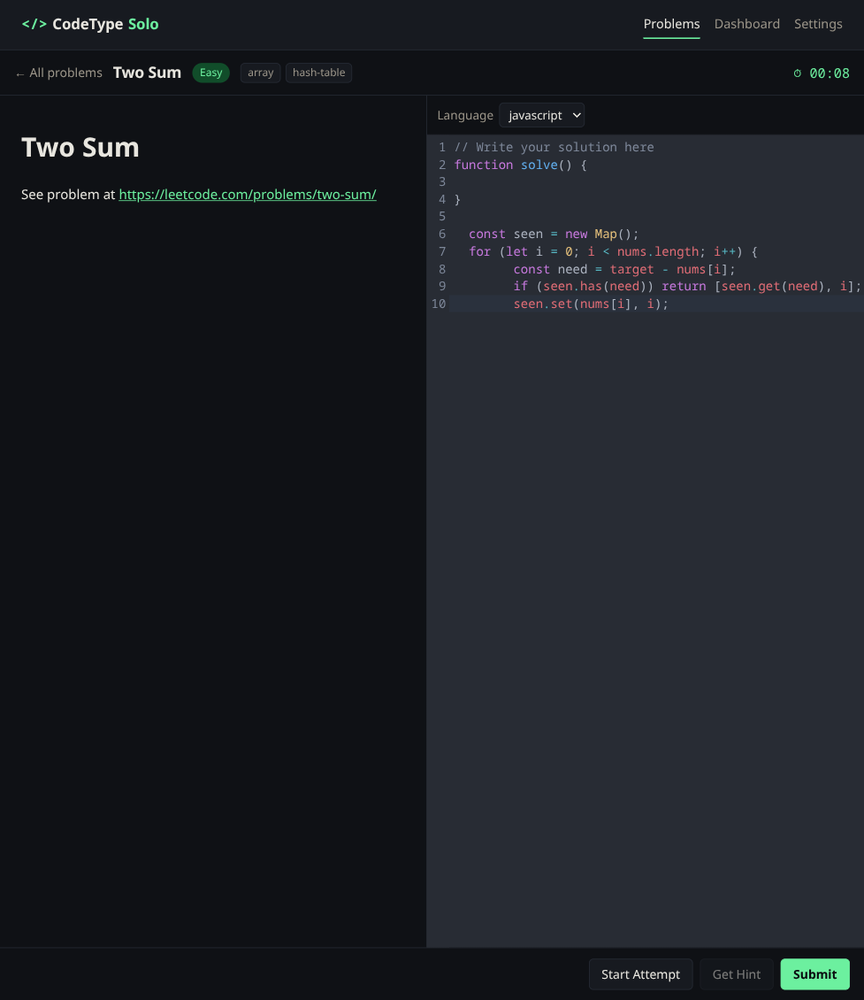
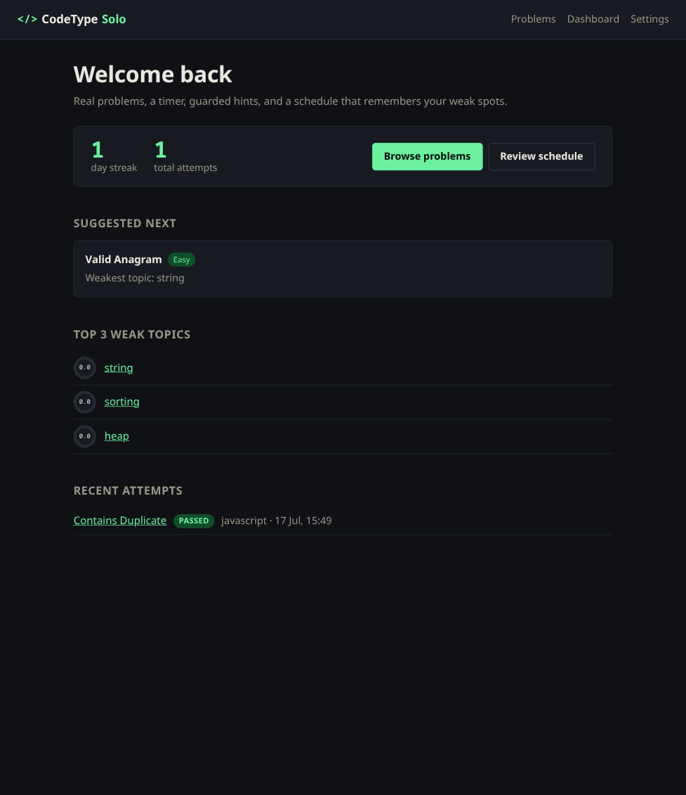
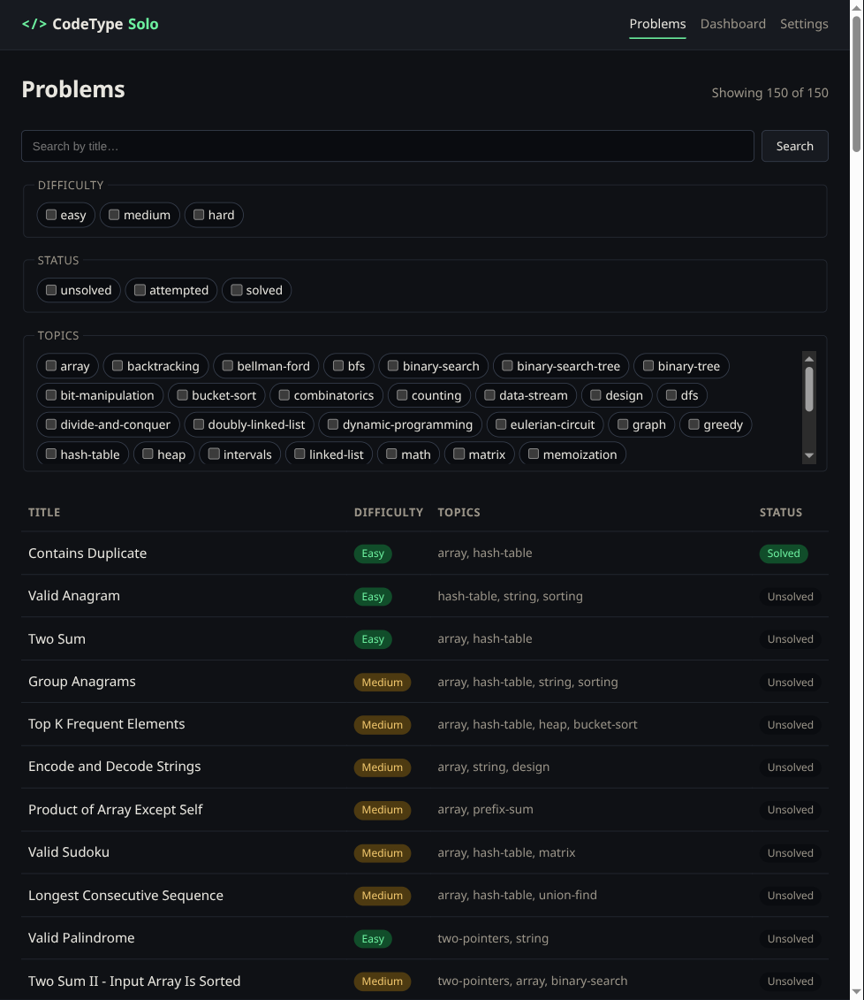
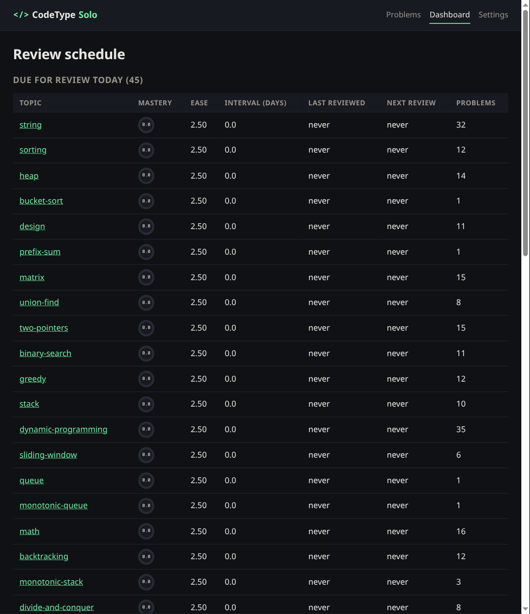
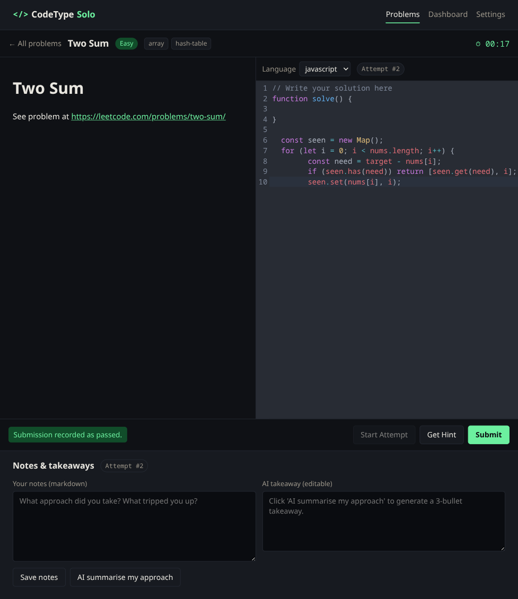
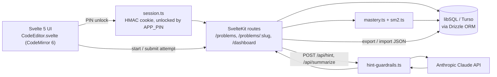
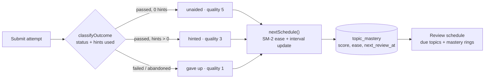

# CodeType Solo

[](https://github.com/jgyy/codetype-solo/actions/workflows/ci.yml)

**Deliberate practice for real interview problems — with a coach that nudges instead of spoon-feeding.** 150 NeetCode-style problems, a real in-browser editor, and an SM-2 spaced-repetition schedule that always knows what you're weak at.

<p align="center">
  
</p>

### B1 Builders Programme — Project #1 of 2: _individual use_

> _"A project that supports **one person's personal or work-related** needs."_

Companion: [`codetype-race`](../codetype-race) — the team/organisational submission (a public typing leaderboard). This one is the opposite by design: no accounts, no shared state, everything scoped to one PIN-protected install.

| Axis | This (`codetype-solo`) | Companion (`codetype-race`) |
|---|---|---|
| Scale | Individual use | Team / organisational use |
| Identity | PIN-only HMAC cookie | Handle + scrypt PIN |
| Shared resource | None | Snippets + leaderboards |

---

## Overview

### Problem
- **Who:** developers and CS students drilling for technical interviews on their own.
- **Issue:** generic trackers don't tell you *what* to practice next, and most AI copilots just hand over the finished solution — which teaches nothing.

### Outcome
- 150 real interview problems solved in a CodeMirror 6 editor (JS/TS/Python), timed, filterable by difficulty/topic/status.
- Every submission feeds an SM-2 scheduler — pass unaided, pass with hints, or give up all move your topic mastery differently, and the dashboard surfaces what's due.
- Claude-guarded hints (`hint-guardrails.ts`) refuse anything that smells like "just give me the answer."
- Local-first: one PIN unlocks one SQLite/Turso database, no account system, full JSON export/import.

---

## Demo

1. Enter your PIN → land on a dashboard with your streak and a suggested next problem.
2. Browse and filter 150 problems by difficulty, topic, or solved status.
3. Open one, write your solution, watch the timer, ask for a bounded hint if stuck.
4. Submit → mastery updates, notes + an optional AI takeaway attach to the attempt.

| | |
|---|---|
|  |  |
|  |  |

---

## Technology Stack

### Frontend components
- SvelteKit + TypeScript, Svelte 5 runes.
- CodeMirror 6 with the One Dark theme for the solving surface.
- No CSS framework — a small hand-rolled design-token system (`+layout.svelte`) shared across every route.

### Backend components
- SvelteKit server routes on Vercel Functions.
- Drizzle ORM over libSQL (local SQLite in dev, Turso in prod).
- HMAC-signed session cookie unlocked by a single `APP_PIN` — no server-side session store.
- Anthropic Claude for `/api/hint` and `/api/summarize`, gated by `hint-guardrails.ts`.
- SM-2 spaced repetition (`sm2.ts`, `mastery.ts`) driving `topic_mastery`.



Every submission is classified, scored, and rescheduled the same way:



### Claude prompt guardrails
`src/lib/server/hint-guardrails.ts` validates *before* tokens are spent and sanitises *after*: pre-call regex rejects "full solution" / prompt-injection phrasing and oversize questions; the system prompt is capped to short conceptual hints with no full code; the response is stripped of long fenced code blocks and truncated; a per-session rate limit caps hints per minute.

---

## Development Approach with AI

| Tool | Model | Purpose |
|---|---|---|
| Claude Code | Opus 4.7 | Primary implementer — schema, guardrails, multi-file refactors |
| Anthropic API | `claude-sonnet-4-6` | Runtime `/api/hint` and per-attempt AI takeaway |
| GPT-5 | — | Upstream design critique (schema indexes, SM-2 parameters) |

**Key prompt:** *"Write a coach system prompt that refuses to write the full solution but still helps a stuck solver."* → `buildSystemPrompt` in `hint-guardrails.ts`.

**Key decisions:** HMAC cookie over a DB session table · `@libsql/client` everywhere instead of a `better-sqlite3` + Turso split (was a leaky abstraction) · hint text never stored verbatim, only `level` + timestamp · SM-2 quality comes from the pass/hint/give-up outcome, never raw speed.

**Responsible use:** no production data or secrets pasted into AI tools; every hint is rate-limited and guardrailed; every AI diff goes through human review + `npm run check` + `npm run lint`.

---

## Installation

```bash
npm install
cp .env.example .env   # set APP_PIN and SESSION_SECRET
npm run dev
```

Local SQLite lands at `./data/codetype.db`, seeded from `data/seed-problems.json`.

**Deploy (Vercel + Turso):**
```bash
turso db create codetype-solo
DATABASE_URL=libsql://... DATABASE_AUTH_TOKEN=... npx drizzle-kit push
```
Set `DATABASE_URL`, `DATABASE_AUTH_TOKEN`, `APP_PIN`, `SESSION_SECRET`, `ANTHROPIC_API_KEY` in Vercel env, then deploy.

---

## Usage

```bash
npm run dev          # dev server
npm run check        # type-check
npm run lint         # prettier + eslint
npm test             # vitest + playwright
```

1. Open `/`, enter `APP_PIN` → 30-day HMAC cookie issued.
2. Filter problems by `?q=`, `?difficulty=`, `?topic=`, `?status=`.
3. Solve, request a hint (level 1–3) if stuck, submit.
4. Check `/dashboard` for what's due next.

---

## Project Structure

```
codetype-solo/
├── src/
│   ├── routes/                    # SvelteKit routes (UI + server endpoints)
│   └── lib/
│       ├── components/            # CodeEditor.svelte, MasteryRing.svelte
│       └── server/
│           ├── db/                # schema.ts, libSQL client
│           ├── session.ts         # HMAC cookie
│           ├── mastery.ts + sm2.ts
│           ├── backup.ts          # export/import
│           └── hint-guardrails.ts
├── tests/                         # Vitest + Playwright
├── assets/screenshots/            # README images
└── data/seed-problems.json        # 150 problems
```

---

## Reflection

**Worked:** schema-first development gave every later AI prompt a stable contract; guardrailing `/api/hint` before shipping caught the most obvious misuse early.

**Failed / changed:** the first AI hint endpoint returned full solutions — caught in review, motivated `hint-guardrails.ts`. Moved from a DB session table to an HMAC cookie once the target was Vercel + Turso.

**Not built (deliberately):** no accounts, no CSS framework, no live typing-speed metrics — this is a solve-and-remember tool, not a WPM tool (that's what the companion project is for).

---

## License

MIT — see `LICENSE`.
