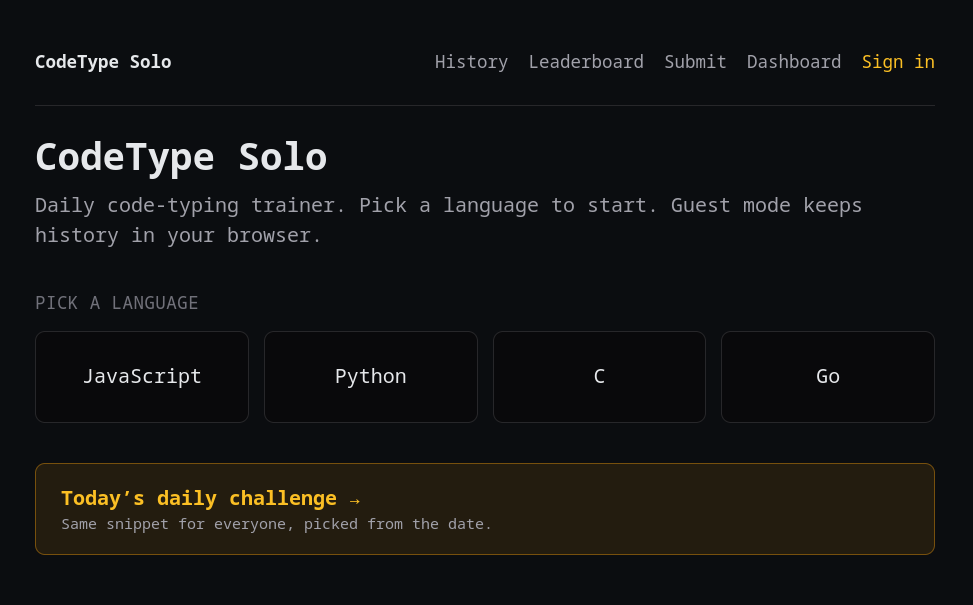
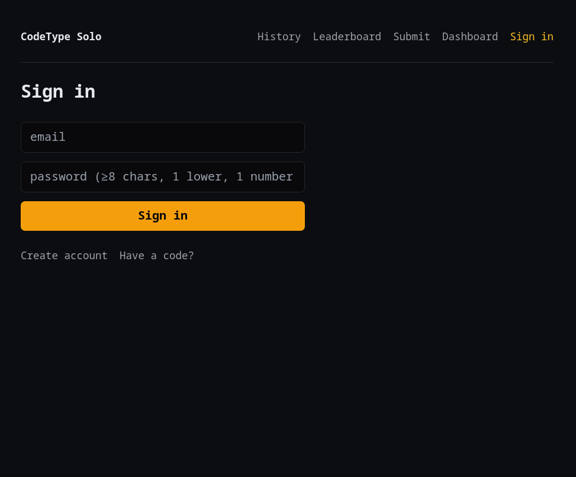
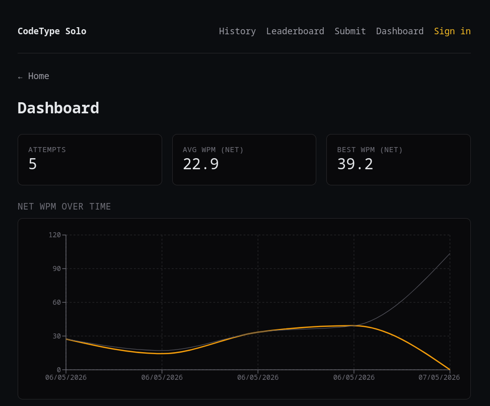
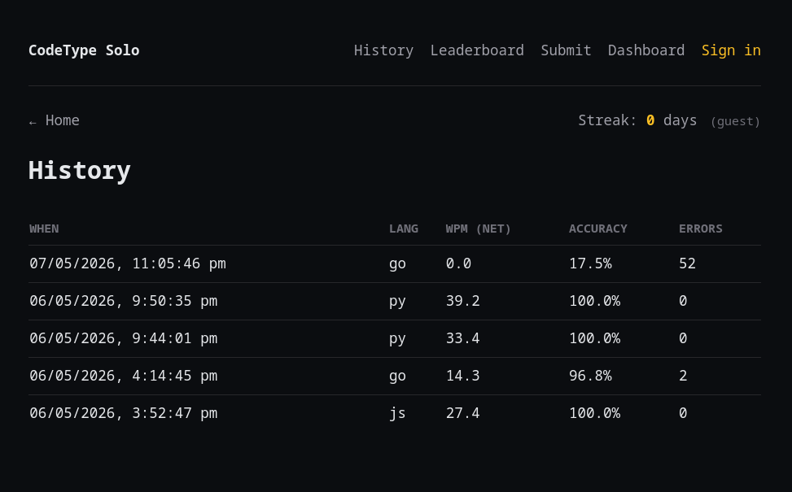
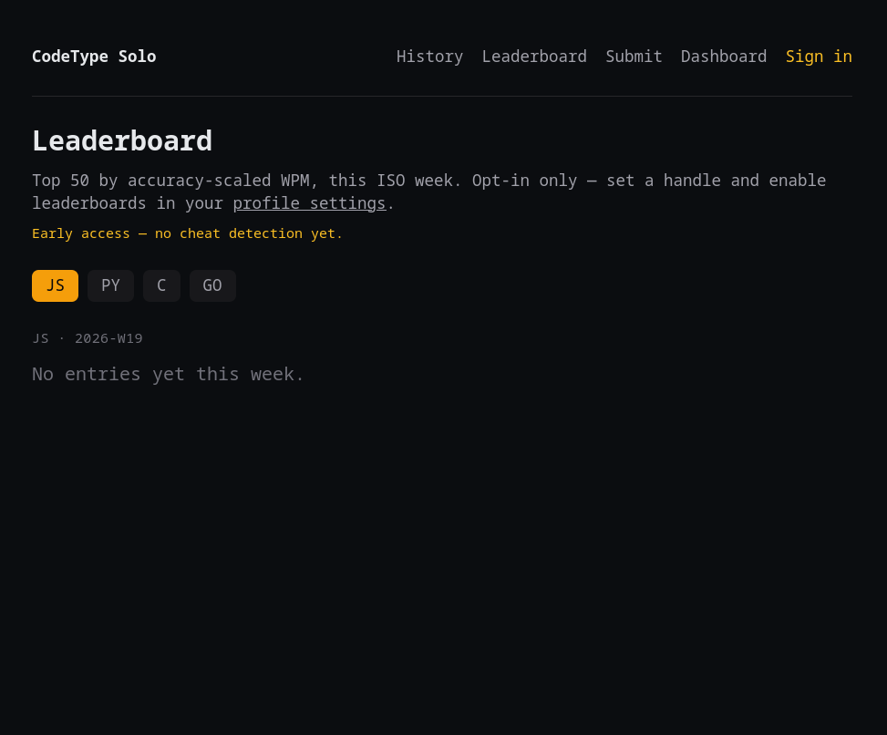
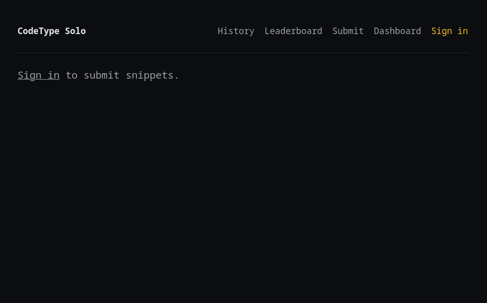

# codetype-solo

A daily code-snippet typing trainer for a single developer. Pick a language, type real code against the clock, get **WPM / accuracy / streak** stats, and watch your progress over time.

> **Stack:** Next.js 15 (static export) + TypeScript + Tailwind · Bun workspaces · AWS Lambda + API Gateway HTTP + DynamoDB + Cognito · S3 + CloudFront · AWS CDK (TypeScript).
> **Cost:** sits inside the free tier for personal use (~$0/mo).

---

## Overview

### Problem

- **Who is affected?** A solo developer (me) who wants to improve raw coding speed and accuracy on real-world syntax — not English prose like Monkeytype, and not toy katas.
- **What is the issue?** Generic typing tests don't drill the symbols, indentation patterns, and keywords that dominate everyday programming (`=>`, `::`, `{}`, `:=`, `func`, `const`). Existing code-typing sites either lock features behind paid tiers, log progress per-browser only, or don't support multiple languages side-by-side. There was no zero-cost, multi-language, cloud-synced trainer with a daily-challenge habit loop.

### Outcome

- **What was achieved?** A working fullstack app: pick from 4 seeded languages (C, Go, JavaScript, Python), type a real snippet, and the server returns recomputed WPM/accuracy plus an updated streak. Daily challenge is deterministic per UTC date so any device sees the same prompt. Guest mode persists to `localStorage`; signed-in mode syncs to DynamoDB across devices.
- **Measurable results:**
  - **28 unit + handler tests pass** (`shared/tests/wpm.test.ts`, `streak.test.ts`, `api/tests/handlers/*`).
  - **11 Lambda handlers** behind a JWT-authorised HTTP API.
  - **Free-tier hosting**: CloudFront + S3 static + on-demand Lambda + DynamoDB on-demand → ~$0/mo for one user.
  - **Cold path safe**: idempotent `PutItem` with `ConditionExpression`; daily-challenge self-seeds via `attribute_not_exists(SK)` so racing cold Lambdas can't double-write.

---

## Demo

Typical flow from the user's perspective, start to finish:

### 1. Home — landing page



Anyone hitting the CloudFront URL lands here. From here you either continue as a guest (data → `localStorage`) or sign in for cross-device sync.

### 2. Sign in — Cognito-backed auth



Cognito User Pool (free tier). The JWT `sub` returned here becomes the DynamoDB partition key (`PK = USER#<sub>`) for every subsequent write — auth boundary == storage boundary.

### 3. Dashboard — today's challenge + recent stats



The daily challenge is a deterministic FNV-1a hash of the UTC date, so every device sees the same prompt. Recent stats come from `attempts-list` scoped to the caller's `PK`.

### 4. Play — type the snippet

The user picks a language (`c` / `go` / `js` / `py`), a snippet renders, the timer starts on the first keystroke, and per-character correctness is highlighted live. On finish, the server recomputes WPM and accuracy, updates the streak, and returns the result. (Live-typing capture is most readable in the app itself.)

### 5. History — attempts over time



Paginated per-user attempts pulled via `attempts-list`. Each row shows server-recomputed WPM, accuracy, and the language.

### 6. Leaderboard — top WPM per language



Aggregated via `leaderboard-get`. Because every attempt's WPM is server-recomputed, leaderboard numbers can't be inflated by a tampered client.

### 7. Submit — propose new snippets



Users propose new snippets via `submissions-post`; moderation happens through `submissions-approve` / `submissions-reject`. Approved snippets enter the rotation for the daily challenge and free play.

---

## Technology Stack

### Frontend components

- **Next.js 15** (App Router, static export via `output: "export"`) — pages under `web/src/app/{play,history,signin,dashboard,leaderboard,submit}`.
- **TypeScript** end-to-end; shared domain types imported from `@codetype/shared`.
- **Tailwind CSS** for styling.
- **Generated typed API client** (`web/src/lib/api-client/`) produced from the OpenAPI contract in `docs/api/`.
- **Cognito Hosted UI / amplify-style JWT** for sign-in; guest mode falls back to `localStorage`.
- **Hosting:** S3 (static bucket) fronted by CloudFront.

### Backend components

- **AWS Lambda × 11 handlers** (Bun-bundled to `api/dist/`):
  `attempts-list`, `attempts-post`, `daily-get`, `leaderboard-get`, `profile-upsert`, `snippet-get`, `snippet-retract`, `submissions-list`, `submissions-post`, `submissions-approve`, `submissions-reject`.
- **API Gateway HTTP API** with a Cognito JWT authoriser. `sub` from the JWT is used as the DynamoDB partition key (`PK = USER#<sub>`) so a forged request can't address another user's items.
- **DynamoDB** single-table design (on-demand billing).
- **Cognito User Pool** (free tier, 50k MAU).
- **Shared domain core** (`shared/src/`): pure-TS WPM calc, streak logic (ISO-week aware), anti-cheat heuristics, blocklist, Zod schemas, `Result` type — TDD'd with 17 unit tests.
- **Infra:** AWS CDK (TypeScript) in `infra/` provisions the whole stack.

---

## Development Approach with AI

### AI tools, services, and models used

| Tool | Model(s) | Purpose |
|---|---|---|
| **Claude Code** (CLI) | Claude Opus 4.7 / Sonnet 4.6 | Primary pair-programmer: scaffolding, refactors, test authoring, debugging, infra writes |
| **Codex CLI** | GPT-5-class | Cross-checking tricky type-narrowing and CDK constructs |
| **GitHub Copilot** | — | In-editor line completions for boilerplate |
| **OpenAPI Generator** (driven by Claude) | — | Generated the typed `web/src/lib/api-client/` from `docs/api/openapi.yaml` |

### AI agents / skills invoked

- **`feature-dev`** — guided feature scoping for the daily-challenge mechanic and the submissions moderation flow.
- **`systematic-debugging`** — root-causing the post-attempt response union narrowing (see commit `afd9c07`).
- **`test-driven-development`** — drove `shared/` (WPM, streak) red-green-refactor cycles before any UI was built.
- **`code-review` / `coderabbit:code-review`** — pre-merge passes on Lambda handlers and CDK stacks.
- **`verification-before-completion`** — required passing `bun test` + a real `cdk synth` before claiming a deploy step done.
- **`Explore` subagent** — initial codebase mapping and dependency tracing across the four workspaces.

### Key prompts used

- _"Design a single-table DynamoDB schema for per-user attempts, daily challenges, leaderboard rollups, and snippet submissions. The partition key must be `USER#<sub>` so the JWT boundary equals the auth boundary."_
- _"Write the WPM calculator first as a pure function with property-style tests covering: empty input, all-correct, partial errors, sub-second sessions, and the standard 5-chars-per-word convention. Implementation comes after the tests."_
- _"The daily challenge must be deterministic per UTC date but cheap. Use FNV-1a over the date string mod the snippet count. Make the read path self-seeding under `attribute_not_exists(SK)` so two cold Lambdas racing the same morning can't double-write."_
- _"Generate a typed TypeScript fetch client from `docs/api/openapi.yaml`. The post-attempt response is a discriminated union — narrow on the discriminant before reading fields, no `as` casts."_
- _"Tighten the CDK Lambda role: only the four DynamoDB actions actually used, scoped to the table ARN and its index ARNs. No `dynamodb:*`."_

### Key review points and decisions made

| Review point | Decision | Rationale |
|---|---|---|
| Compute WPM client-side or server-side? | **Server recomputes on every attempt**; client number sets only a `wpm_mismatch` flag | Client values are untrusted; recompute is O(n) over snippet length and effectively free |
| Auth boundary | **JWT `sub` → `PK = USER#<sub>`** | Auth boundary == storage boundary; a forged request literally cannot address another user |
| Daily-challenge race | **Self-seeding read with `attribute_not_exists(SK)` condition** | Cheaper than a scheduled seeder; safe under cold-start fan-out |
| Idempotency | **Every `PutItem` carries a `ConditionExpression`** | Network retries no-op instead of duplicating attempts |
| Guest mode | **`localStorage` fallback when `web/.env.local` is absent** | Lets the app run with zero AWS config for local dev / demo |
| Monorepo layout | **Bun workspaces (`shared`/`web`/`api`/`infra`)** instead of a flat `src/` | Lets the pure domain core be unit-tested without pulling Next.js or AWS SDK |
| AI output discipline | **All AI-generated CDK + handler code re-read and tested before commit** | Caught a too-broad IAM policy and a missing `ConditionExpression` on first review |

---

## Installation

### Prerequisites

- [Bun](https://bun.sh) ≥ 1.3 (`curl -fsSL https://bun.sh/install | bash`)
- AWS CLI configured with the profile of your choice (e.g. `aws configure --profile <your-profile>`). No profile is hardcoded — pass `--profile <your-profile>` to the CDK / AWS CLI commands below, or export `AWS_PROFILE` once per shell. Default region: `ap-southeast-1`.
- AWS CDK is bundled as an `infra/` devDependency, so no global install is needed.

### Local install + run (no AWS needed)

```bash
bun install
bun test                          # 28 tests across shared/ + api/
bun --filter @codetype/web dev    # http://localhost:3000 (guest mode)
```

Without `web/.env.local`, the web app runs in **guest mode**: attempts persist to `localStorage`. Sign-in is hidden until Cognito is configured.

### Deploy to AWS

```bash
# First time only — bootstrap CDK assets in this account/region.
bun run bootstrap -- --profile <your-profile>

# Full deploy: build api → cdk deploy → seed → build web → S3 sync → CF invalidate.
AWS_PROFILE=<your-profile> bun run deploy
```

Stack-only and web-only variants:

```bash
bun run deploy:stack -- --profile <your-profile>     # cdk deploy only
AWS_PROFILE=<your-profile> bun run deploy:web        # build web → sync S3 → invalidate
```

After the first deploy, populate `web/.env.local` from stack outputs:

```bash
bun run outputs -- --profile <your-profile>   # prints ApiUrl, UserPoolId, UserPoolClientId, CloudFrontUrl, …
```

```ini
# web/.env.local
NEXT_PUBLIC_API_URL=https://<id>.execute-api.ap-southeast-1.amazonaws.com
NEXT_PUBLIC_COGNITO_USER_POOL_ID=ap-southeast-1_xxx
NEXT_PUBLIC_COGNITO_CLIENT_ID=xxx
NEXT_PUBLIC_COGNITO_REGION=ap-southeast-1
```

Then redeploy the web layer only:

```bash
bun run deploy:web
```

---

## Usage

### End-user flow

1. Visit the CloudFront URL printed by `bun run outputs` (or `http://localhost:3000` for guest mode).
2. **Sign in** (Cognito) — or skip and use guest mode (data stays in `localStorage`).
3. **Dashboard** (`/dashboard`) — see today's daily challenge and recent stats.
4. **Play** (`/play`) — pick a language, type the snippet. Timer starts on first keystroke; live correctness highlighting per character.
5. On finish, the server returns:
   - `wpm` (server-recomputed)
   - `accuracy` (0–1)
   - `streakDays` (updated, ISO-week aware)
   - `wpm_mismatch` flag if the client number disagreed with the server
6. **History** (`/history`) — paginated attempts over time.
7. **Leaderboard** (`/leaderboard`) — top WPM per language.
8. **Submit** (`/submit`) — propose new snippets; moderators approve/reject via `submissions-approve` / `submissions-reject`.

### Developer commands

| Command | What it does |
|---|---|
| `bun test` | All unit + handler tests (`shared/` + `api/`) |
| `bun run dev` | Start Next.js dev server on `:3000` (guest mode) |
| `bun run typecheck` | TypeScript across all workspaces |
| `bun run deploy` | Full deploy: API build → `cdk deploy` → seed → web build → S3 sync → invalidate |
| `bun run deploy:stack` | CDK only (Lambda + HTTP API + DynamoDB + Cognito + S3/CF) |
| `bun run deploy:web` | Build + sync `web/out` to S3 + invalidate CloudFront |
| `bun run synth` / `diff` | `cdk synth` / `cdk diff` against the deployed stack |
| `bun run cdk <cmd>` | Forward any `cdk` subcommand to `infra/` |
| `bun run bootstrap` | One-time `cdk bootstrap` for this account/region |
| `bun run seed` | Seed snippets and 30-day daily-challenge pool into DynamoDB |
| `bun run outputs` | Print CloudFormation outputs for the current stack |

### Expected behaviour examples

- `bun test` → `28 pass · 0 fail`.
- `bun run dev` with no `web/.env.local` → app loads, sign-in button is hidden, attempts go to `localStorage`.
- `bun run deploy` on a clean account → idempotent; re-running skips unchanged CFN resources and re-seeds DynamoDB only for missing keys.

---

## Project Structure

This repo uses **Bun workspaces** instead of the flat `src/` / `tests/` layout. Mapping to the suggested B1 structure:

| B1 suggested | This repo | Notes |
|---|---|---|
| `src/` | `shared/src/`, `web/src/`, `api/src/`, `infra/` | Split per concern so the pure domain core (`shared/`) is testable without Next.js or AWS SDK |
| `tests/` | `shared/tests/`, `api/tests/` | Co-located with the workspace they test |
| `docs/` | `docs/` | API contract (`docs/api/openapi.yaml`) + plan + specs |
| `scripts/` | `scripts/` | Repo-wide automation (LOC counter, etc.) |
| `data/` | `data/snippets/` | Per-language snippet JSON: `c.json`, `go.json`, `js.json`, `py.json` |
| `package.json` | `package.json` (root) + per-workspace | Root declares workspaces and orchestration scripts |
| `LICENSE`, `.gitignore`, `README.md` | At repo root | ✓ |

### Key folders

```
codetype-solo/
├── shared/   # @codetype/shared — pure-TS WPM, streak, schemas, anti-cheat (TDD'd)
│   ├── src/
│   └── tests/
├── web/      # @codetype/web — Next.js 15 static export
│   └── src/
│       ├── app/{play,history,signin,dashboard,leaderboard,submit}/
│       ├── components/
│       └── lib/api-client/   # generated from docs/api/openapi.yaml
├── api/      # @codetype/api — Lambda handlers (Bun bundles to api/dist/)
│   ├── src/{handlers,lib,middleware,repos}/
│   └── tests/handlers/
├── infra/    # @codetype/infra — AWS CDK app + deploy/seed scripts
│   └── bin/app.ts
├── data/snippets/  # raw snippet JSON per language
├── docs/           # plan, specs, OpenAPI contract
└── scripts/        # repo-wide tooling
```

---

## Architecture

```
                        ┌────────────┐
        users ─────►    │ CloudFront │ ─► S3 (Next.js static export)
                        └────┬───────┘
                             │ JSON over HTTPS (Bearer JWT)
                             ▼
                       ┌────────────┐         ┌──────────────┐
                       │ HTTP API   │ ──────► │ Lambda × 11  │
                       │ (JWT auth) │         │ (Bun bundles)│
                       └────────────┘         └──────┬───────┘
                                                     │
                                              ┌──────┴───────┐
                                              │ DynamoDB     │
                                              │ single-table │
                                              └──────────────┘
                       Cognito User Pool (free tier, 50k MAU)
```

- **Auth boundary is the partition key.** `sub` from the JWT is used as `PK = USER#<sub>`.
- **Idempotent writes.** Every `PutItem` uses a `ConditionExpression`.
- **Server recomputes WPM** on every attempt; client-supplied numbers only set a `wpm_mismatch` flag.
- **Daily challenge** is a deterministic FNV-1a hash of the date string, with a self-seeding read path guarded by `attribute_not_exists(SK)` to make racing cold Lambdas safe.

---

## Reflection

### What worked

- **Pure-TS domain core, TDD'd first.** Writing `wpm.ts` and `streak.ts` as pure functions with red-green-refactor cycles before any UI or AWS code meant the hardest correctness bugs were caught in milliseconds, not in a deployed Lambda. 17 of the 28 tests live here.
- **Auth boundary == storage key.** Tying `PK` to the JWT `sub` removed an entire class of authz bugs at the schema level — there's no code path where a handler can "forget" to scope a query to the caller.
- **Self-seeding daily challenge.** Using `attribute_not_exists(SK)` on the read path meant I didn't need a scheduled seeder Lambda or a CloudWatch cron — first read of the day creates the row, subsequent reads are pure GETs.
- **AI for plumbing, human for invariants.** Letting Claude Code generate the OpenAPI client, CDK boilerplate, and per-handler scaffolds while I personally owned the schema design and IAM scoping kept velocity high without trusting AI on the security-critical bits.
- **Static export + CloudFront.** Zero server cost for the web layer; Lambdas only spin up when there's real traffic.

### What failed (and what I changed)

- **Initial post-attempt response was an unnarrowed union.** The web client read `.wpm` directly without checking the discriminant, so TypeScript was happy but runtime would explode on the error variant. **Fix:** narrowed before reading fields (commit `afd9c07`).
- **First IAM policy was `dynamodb:*` on `*`.** AI-generated CDK was too broad. **Fix:** scoped to the four actions actually used (`PutItem`, `GetItem`, `Query`, `UpdateItem`) on the table ARN + index ARNs only.
- **First daily-challenge implementation seeded via a cron.** Overkill for a single-user app. **Fix:** replaced with the self-seeding read path; deleted the cron.
- **CDK app entrypoint was using `npx ts-node`.** Slow and out-of-band with the rest of the Bun toolchain. **Fix:** `cdk.json` now runs `bun run bin/app.ts` directly (commit `b266153`).
- **LOC script counted YAML.** Skewed numbers because of the OpenAPI spec. **Fix:** excluded YAML from the LOC counter (commit `e029ad6`).
- **Trusted client-supplied WPM in v0.** Trivially cheatable. **Fix:** server recomputes; client number only flips a `wpm_mismatch` audit flag.

### Rationale for the major design choices

- **Why Bun workspaces over a flat `src/`?** The B1 suggested layout assumes a single-package project. For a fullstack app with a pure domain core, splitting `shared` / `web` / `api` / `infra` is what lets `bun test` run the WPM/streak tests in milliseconds without spinning up Next.js or the AWS SDK.
- **Why DynamoDB single-table?** On-demand billing + one table = ~$0/mo for one user, and the access patterns (per-user attempts, per-day challenge, per-language leaderboard) are all PK/SK queries — no joins needed.
- **Why Cognito over rolling auth?** Free tier covers 50k MAU; HTTP API has a first-class JWT authoriser; the JWT `sub` plugs straight into the partition key. Less code, smaller blast radius.

---

## Testing

```bash
bun test
# 28 pass · 0 fail
# - shared/tests/wpm.test.ts        (8 cases, plan §4)
# - shared/tests/streak.test.ts     (9 cases, plan §4)
# - api/tests/handlers/*.test.ts    (11 cases, mocked DynamoDB)
```

---

## License

MIT — see [LICENSE](./LICENSE).
